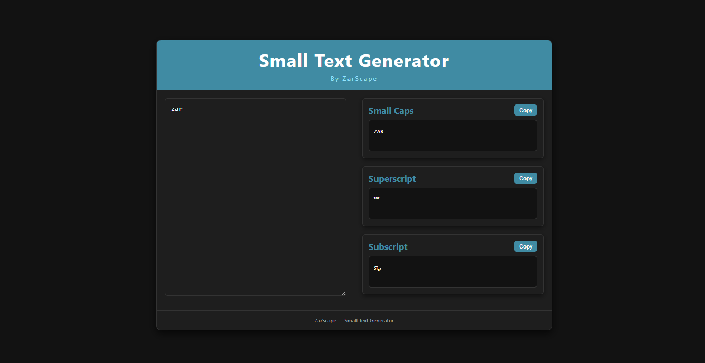

# 📝 Small Text Generator

A **fast, free, and easy-to-use text transformer** by ZarScape that converts your text into **small caps, superscript, or subscript** instantly.  
Built with **HTML, CSS, and JavaScript**, with a sleek **dark mode design**.

---

## ✨ Features

- Convert text to **Small Caps**  
- Convert text to **Superscript**  
- Convert text to **Subscript**  
- **Copy to clipboard** with one click  
- Dark mode interface  
- Fully responsive for **desktop and mobile**  

---

## 📂 Project Structure

```
📦 Small-Text-Generator
├── index.html
├── css/
│   └── style.css
└── js/
    └── script.js
```

---

## 🚀 How to Use

1. **Clone the repository**

```bash
git clone https://github.com/ZarScape/Small-Text-Generator.git
```

2. **Open `index.html`** in your browser.  
   No build tools required — works instantly.

---

## 🧩 Code Overview

### **HTML**
- Input textarea for typing text  
- Output sections for small caps, superscript, and subscript  
- Copy buttons for easy text copying  
- Meta tags for SEO and social sharing  

### **JavaScript**
- Maps characters to **small caps, superscript, and subscript**  
- Updates output in real-time as you type  
- Copy button functionality with feedback  

### **CSS**
- Dark mode design  
- Card-based layout  
- Responsive layout for mobile and desktop  
- Highlighted accent color for buttons and headers  

---

## 🎨 Preview


---

## 🔧 Tech Stack

- **HTML5**
- **CSS3** (Dark mode, responsive layout)
- **JavaScript** (DOM manipulation, clipboard API)

---

## 📜 License

This project is licensed under the **MIT License**.  
© 2025 **Muhammad Abuzar (ZarScape)**

---

## 🔗 Links

- **Live Demo:** [Small Text Generator](https://zarscape.github.io/Small-Text-Generator/)  
- **GitHub Repo:** [Small-Text-Generator](https://github.com/ZarScape/Small-Text-Generator)
